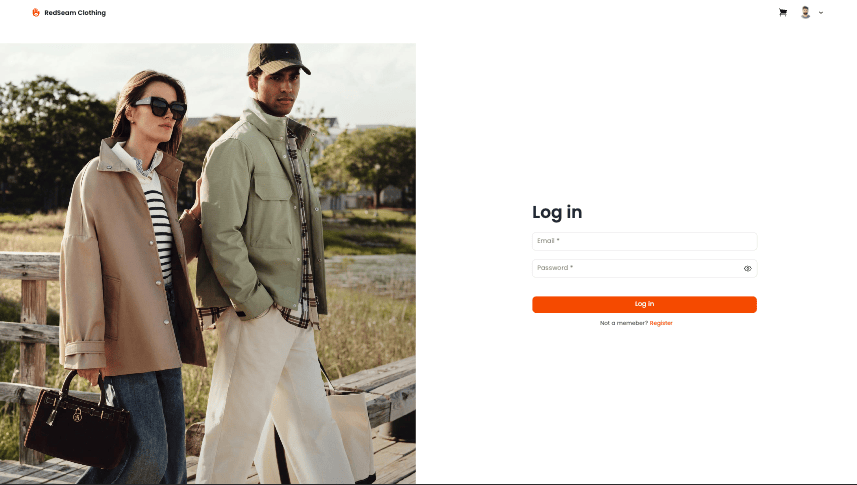
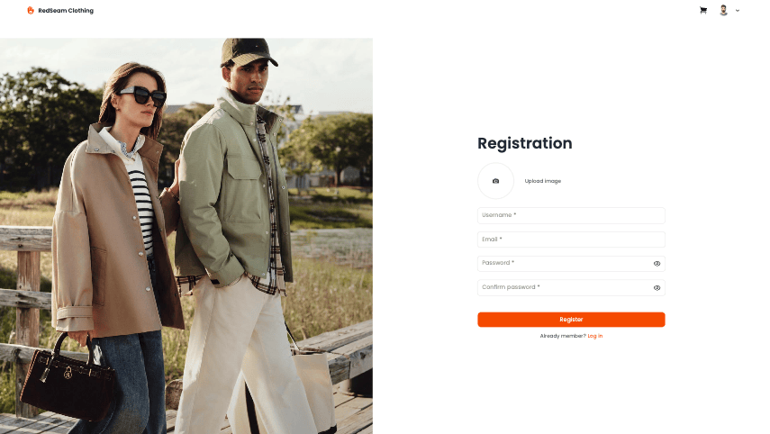
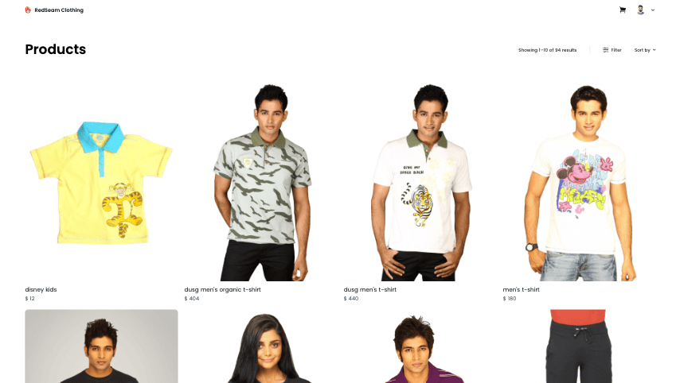
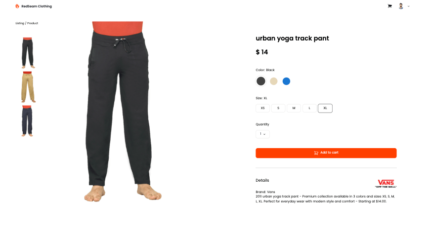
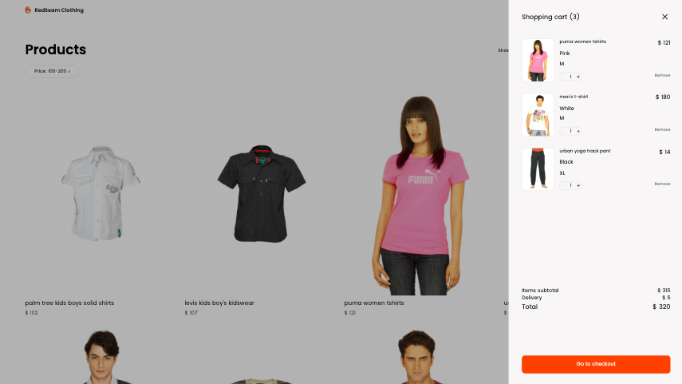
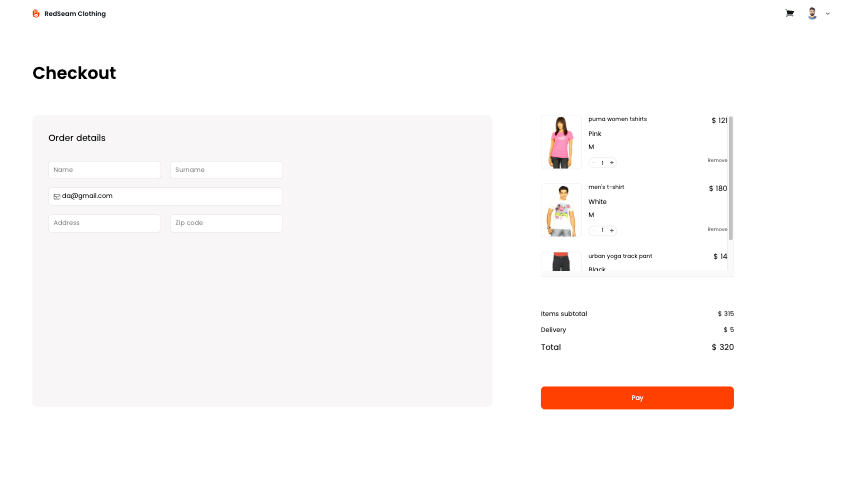

# RedSeam Clothing Website

This is an e-commerce clothing website built using React and Tailwind CSS.  
The website provides a seamless shopping experience where users can browse products, filter and sort by price, view detailed product information, and manage their shopping cart.

### Table of Contents

- [Key Features](#Key-Features)
- [Tech Stack](#tech-stack)
- [Resources](#resources)
- [Getting Started](#getting-started)
- [Screenshots](#screenshots)

### Key Features

- **Product Browsing**: Explore clothing products with detailed descriptions and images.
- **Filtering & Sorting**: Search and filter by price, categories, or attributes.
- **Product Details**: Choose size, color, and see available product images.
- **Shopping Cart**: Add, remove, and update product quantities easily.
- **Checkout**: Simple flow for completing a purchase.
- **Authentication**: Register and log in to manage your shopping.

### Tech Stack

- [React](https://react.dev/) – Frontend library for building UI
- [React Router](https://reactrouter.com/) – Declarative routing for React
- [Axios](https://axios-http.com/) – HTTP client for API requests
- [Tailwind CSS](https://tailwindcss.com/) – Utility-first CSS framework
- [JavaScript (ES6+)](https://developer.mozilla.org/en-US/docs/Web/JavaScript)

### Resources

- [Assignment](https://redberry.gitbook.io/redberry-bootcamp.store-shopping-website)
- [figma](https://www.figma.com/design/mNz6RGauIhHyuMrGFcPBHs/Bootcamp---RedSeam-Clothing?node-id=108-803&t=8oE9Vc8KBGwEurfB-0)

### Getting Started

1\. Clone the repository to your local machine

```sh
https://github.com/Daniel160407/RedSeamClothing-Redberry
```

3\. Run npm install to install the dependencies

```sh
npm install
```

4\. Run npm install axios, npm install js-cookie and npm install tailwindcss @tailwindcss/vite

```sh
npm install axios
npm install js-cookie
npm install tailwindcss @tailwindcss/vite
```

5\. Run npm run dev to start the server

```sh
npm run dev
```

### screenshots







